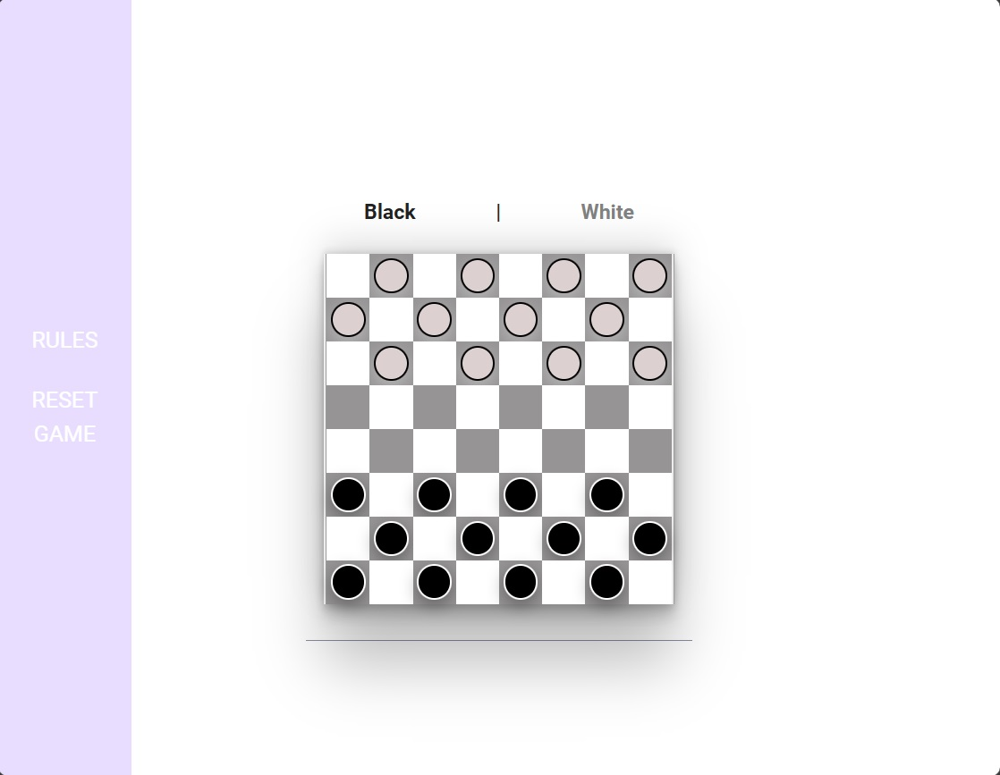
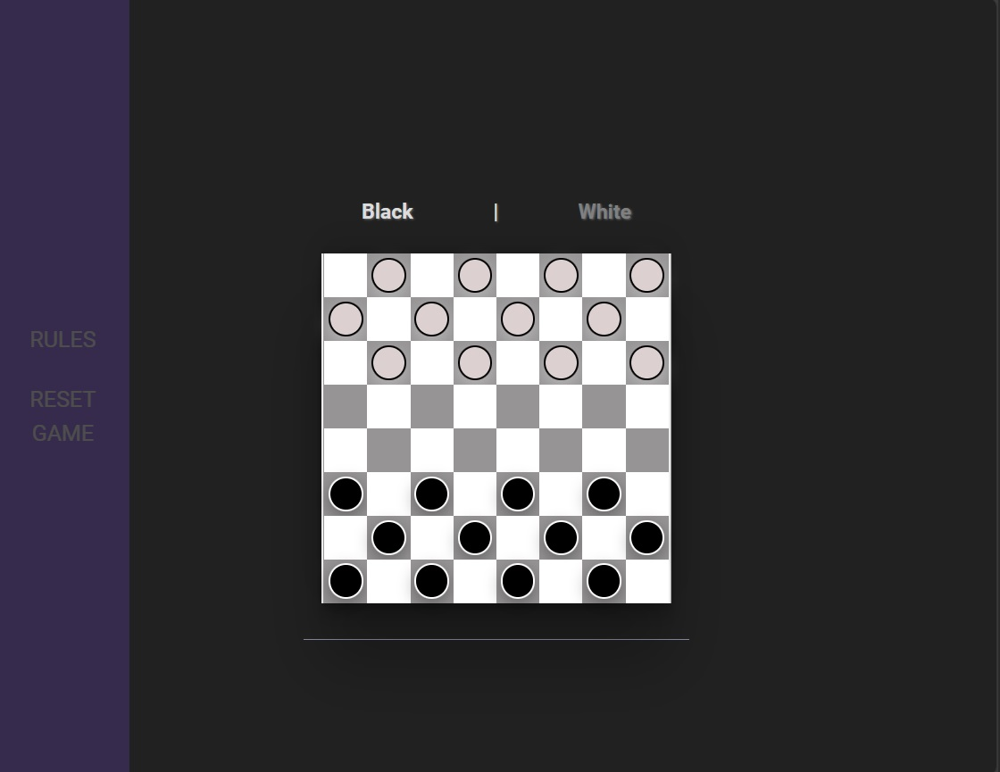

# Developing a Browser-Based Game Project - Checkers

## Project Brief

**MVP**

- Render the game in the browser using the DOM manipulation techniques demonstrated in lecture.
- Include win/loss logic and render win/loss messages in HTML. The game you chose must have a win/lose condition.
- Include separate HTML, CSS, JavaScript, and JavaScript data files organized in an appropriate directory structure.
- Include all required features specific to your game.
  For Checkers, this includes
  - Submit an initial data of your game state
  - Pseudocode
- The game is deployed online so that the rest of the world can play it.

## Time Frame

1 Week

## Checkers

I love playing chess (and Checkers to an extent) so Checkers was the most interesting game that caught my attention out of the list of recommend games. Checkers is also known as Draughts, and is a strategy board game for two players with fairly straightforward rules though there are variations to those. For my version of Checkers, I have opted for mandatory captures, but the player is not forced to choose an action that leads to the greatest number of captures.

Check out the rules and the game at my [deployed page](https://siegefried.github.io/ga-unit1-checkers-game/).

## Screenshots (Light / Dark Mode)





## Technologies Used

- Javascript
- Git / Github
- HTML
- CSS

## References

At the moment I am not too familiar with CSS, so a large part of the fancier CSS used was referenced from the following sources

[Simple CSS](https://simplecss.org/)
The framework I built off from

[Navbar Animation CSS](https://dev.to/kiranrajvjd/10-simple-navigation-bar-hover-animations-1980)
The visual effect to outline the element in my navbar

[Landing Page Buttons to Same Size](https://css-tricks.com/equal-columns-with-flexbox-its-more-complicated-than-you-might-think/) I struggled to get my 2 buttons to the same size using just Flexbox

I ran into an error in the console after deployment for not being able to find favicon.ico, and used the following source to generate one

[favicon.io](https://favicon.io/favicon-generator/)

## Description

This game was designed and implemented with the tools and concepts I learned while attending the Software Engineering Bootcamp at General Assembly (Singapore).

Not only is Checkers a fun game with many childhood memories for me, I felt that it was an interesting chance to compare logic that I am familiar with in real life against the logic of the code to re-enact the game.

I will be sharing my journey from scratch to completion below, alongside a reflection of what I have learned while building this project.

## User Stories

- As a user, I want to be able to see a landing page to know I'm at the right place
- As a user, I want to be able to check the rules of the game
- As a user, I want to know if it is my turn
- As a user, I want to be able to see the moves available to me when I select a piece (force jump if available)
- As a user, I want to be able to receive a message with the outcome of the game
- As a user, I want to have the option to play another round

## Draft of Rough Flow / Psuedocode

On page load, landing page greets players with 2 options

- check game rules
- start game

Checking game rules unhides hidden element that has list of instructions for this version of Checkers, exiting out of rules hides the element again

On start game, game is initialized and board element is shown with 12 checkers on each player's side on a 8x8 grid
black(red) starts first, on lower half of board, white is second on upper half

On start of turn, evaluate if player has available moves

- if false, game ends with player loss
- else prompt that it is player's turn -> allow selection of piece

On selecting a piece, evaluation occurs to check for possible moves to player

- If jump/capture is available, player is forced to take it (consecutive jumps allowed)
- If jump not available, evaluate possible positions to take (backwards as well if king)
- Highlight possible positions to take
- If no available positions, visually nothing should occur and player not allowed to shift piece
- If positions are available, highlight available spots
- User selects one of available spots to jump/move piece
- If jump, check for further jumps

  - if no jumps available,
    - check for enemy piece count, if 0, end game as winner,
  - else end turn

- On jump, (enemy playerNumPieces --)
- If jump/move, check for change to king
  - if true, checker -> king and end turn
  - else end turn

Move evaluation checks for at least

- .isKing
- 4x movement possibilities
- 4x jump possibilities (forced to execute if available)
- thinking about implementation of jump(s) post jump

End turn = switch player turn, going to start of next player turn

if game.win === true, render a message showing which player won

Draw is usually offered in checkers, need to think about logic of implementation (as per consultation with instructor, not necessary to implement)

Board will be done in HTML/CSS (use flexbox or grid over table), not familiar enough to attempt to generate everything with JS.
Pieces will be objects with properties that indicate if they are king and possible moves available

## Planning Concepts

Checkers is a game for 2 players who switch turns, where each turn involves selecting a single piece and performing an action with it by moving it to a new location in the board. In the event an enemy is captured, the selected piece used to capture cannot be swapped, and must continue to capture further enemy pieces if there are further opportunities.

The standard game board is 8x8, and we can represent it using an array, using 64 elements.

As each square on the board has alternating colors, this means that a square the next row down (+8 elements) is an inaccessible square, so the movement direction can be represented as +/- 7/9. Building on that, the movement for the piece when capturing an enemy can be extrapolated to be +/- 14/18

When a piece reaches the opposite end of the board, it becomes a King and is able to take action in all 4 diagonal directions.

We can now determine that our object to represent a player's piece needs to hold the following information at minimum

- a way to check which specific piece it is out of all the player's pieces
- a way to know where it is on the board
- whether it has become a King
- which directions it can move/capture (+/- 7/9 14/18)

## Initial Data Structure of Game State

```javascript
const game = {
    board: [],
    playerNumPieces[12, 12]
    turn: true, //this game only involves 2 players at maximum so boolean is sufficient (maybe use 0 and 1 to access arrays?)
    win: false, //when no moves available on turn start = lose, when pieces = 0 after opponent's turn
    tie: false, //unsure about implementation of draw as it is usually offered when game is unwinnable for both players
}
```

## Approach to Development

My original timeline was:

Day 1: Implement board and pieces, simulate movement
\
Day 2: Base logic Implementation (evaluation of actions etc.)
\
Day 3: Movement and Jump Logic
\
Day 4: King, Win Condition
\
Day 5: Testing for bugs / Consultation with Instructor
\
Day 6: CSS
\
Day 7: Documentation or working on JS as needed
\
Day 8: End of Project / Presentation

When coding, I was frequently testing with console.logs to ensure I was getting the logic for evaluators right. I also attempted to rememeber to create a new git commit every time I implemented a feature. I got overconfident about how things "should" work once and had to revert to an older commit.
